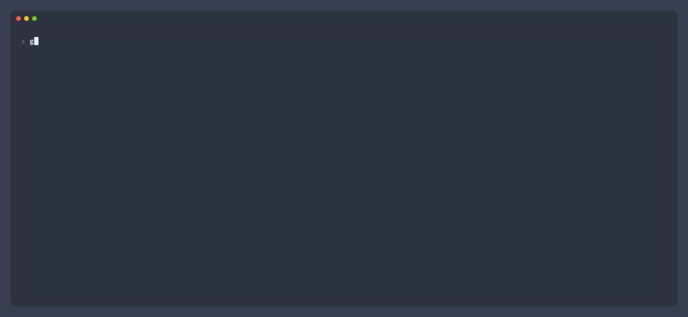

## Usage

```go
package main

import (
    "context"

    "github.com/gaylatea/instrument"
)

func main() {
    ctx := context.Background()
    instrument.Infof(ctx, "Hello!")
}

// Emits a log line:
// {"meta.instance": "018feac5-27db-7dcb-bcaf-483155a5ea06", "meta.timestamp": "2024-06-05T23:39:00Z", "meta.level": "INF", "meta.caller": "main.main", "meta.file": "/Users/gaylatea/src/instrument/example/main.go", "meta.line": 77, "log.message": "Hello!"}
```

### Tags

`instrument` uses tags to contextualize events, allowing you to trace the path of a log. To add tags, use:

```go
newCtx := instrument.With(ctx, "tag.new", true)
```

```go
newCtx := instrument.WithAll(ctx, instrument.Tags{
    "key":     "value",
    "another": time.Now(),
})
```

### Logs

To emit a log line with levels, use:

```go
instrument.Tracef(ctx, "Trace text")
instrument.Debugf(ctx, "Debug text")

instrument.Infof(ctx, "Info text")
instrument.Warnf(ctx, "Warning text")
instrument.Errorf(ctx, "Error text")
```

To force exit the program with a log line, you can use:

```go
instrument.Fatalf(ctx, "This should stop the program.")
```

All the preceding logs support `fmt.Sprintf` formatting.

`instrument` suppresses `Debugf` or `Tracef` logs by default. To turn them on:

```go
instrument.SetDebug(true)
instrument.SetTrace(true) // implies SetDebug(true)
```

### Traces

Tracing wraps a block of code with timing and call stack information. To start a trace:

```go
if err := instrument.WithSpan(ctx, "Name", func(ctx context.Context, addToParent func(instrument.Tags)) error {
    // Your code here.
}); err != nil {
    // Use the returned error.
}
```

The provided `addToParent` function adds tags to the created span from your code.

### Events

To emit an event without the tracing or logging metadata:

```go
instrument.PostEvent(ctx, "Name", instrument.Tags{
    "something": "you need",
})
```

Unlike logs and traces, raw events don't contain tags from the provided context.

## Sinks

### Terminal

`instrument` uses a default terminal sink to emit newline-delimited JSON to `stderr`, with optional colors in a TTY.

You can turn the default sink off with:

```go
instrument.Silence(true)
```

### Custom

<!-- `implement` is the correct term for Go. -->
<!-- vale docs.TooWordy = NO -->

To add a sink, implement the `instrument.Sink` interface.

<!-- vale docs.TooWordy = YES -->

To set a sink for all events:

```go
instrument.UseSink(yourSink)
```

To set a sink for a context and its descendants:

```go
newCtx := instrument.WithSink(ctx, yourSink)
```

## Example

A sample program with all available features: [example/main.go](./example/main.go)



## License

<!-- Disable these styles for license-specific text. -->
<!-- vale docs.MicrosoftPassive = NO -->
<!-- vale docs.Passive = NO -->
<!-- vale docs.E-Prime = NO -->
<!-- vale docs.CommunalAlternatives = NO -->

`instrument` is dedicated to the public domain. See the [CC0-1.0 License](./LICENSE) for details.

<!-- vale docs.MicrosoftPassive = YES -->
<!-- vale docs.Passive = YES -->
<!-- vale docs.E-Prime = YES -->
<!-- vale docs.CommunalAlternatives = YES -->

[](https://tfw.computer/systems/made-with-love)
